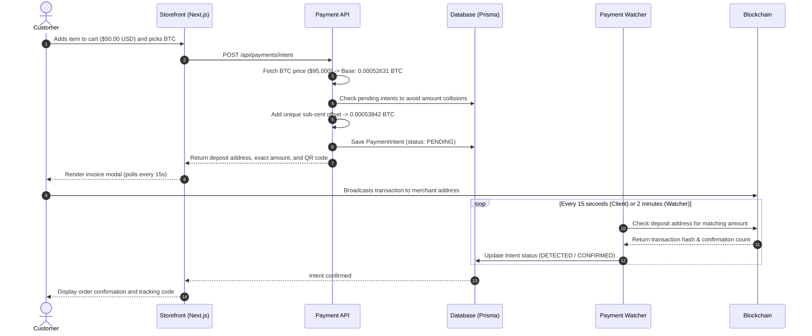

<div align="center">

# Crypto E-Commerce Template

### Self-custodial, open-source e-commerce platform with native cryptocurrency payments.

No payment processors. No monthly fees. No customer tracking.

```
git clone https://github.com/dustindog101/crypto-ecom-template.git
cd crypto-ecom-template && npm install && npm run setup
```

<br />

[](https://nextjs.org/)
[](https://react.dev/)
[](https://www.typescriptlang.org/)
[](https://tailwindcss.com/)
[](https://www.prisma.io/)
[](LICENSE)

<br />

[Quickstart](#quickstart) • [Why This Exists](#why-this-exists) • [Supported Assets](#supported-assets) • [How Payments Work](#how-payments-work) • [Features](#features) • [Deployment](#production-deployment)

</div>

---

## Why This Exists

Most e-commerce platforms force merchants into custodial payment gateways with 3% fees, chargeback fraud, rolling reserves, and invasive customer identity checks.

This template is built for developers and merchants who want a sovereign alternative:

1. **Direct to your wallet**: Customer payments go straight to your own address. Funds never touch a third-party custodial account.
2. **No address derivation complexity**: Instead of running a heavy HD wallet server to create new addresses for every cart, the engine uses a single deposit address per coin and appends a tiny unique atomic offset (1 to 9999 units) to identify the transaction.
3. **Private and frictionless**: Customers can buy as guests with just a contact handle or email. Every order gets a public tracking code (`/track/[code]`).
4. **Zero secrets in source**: No API keys, database credentials, or deposit addresses are hardcoded. Everything is configurable through `.env` and an interactive terminal wizard.

---

## Supported Assets

| Coin / Token | Network | Verification Method | Min Confirmations |
| :--- | :--- | :--- | :--- |
| **Bitcoin (BTC)** | Bitcoin Mainnet | Esplora / Mempool API | 1 block |
| **Litecoin (LTC)** | Litecoin Mainnet | Esplora API | 2 blocks |
| **Solana (SOL)** | Solana Mainnet | Solana JSON-RPC | Finalized (32 confs) |
| **USDC (Ethereum)** | Ethereum ERC-20 | Etherscan V2 API | 12 blocks |
| **USDC (Base)** | Base EVM | Basescan / Blockscout | 10 blocks |
| **USDC (Polygon)** | Polygon PoS | Polygonscan | 30 blocks |
| **USDC (Solana)** | Solana SPL | Solana JSON-RPC | Finalized (32 confs) |

All networks can be enabled or disabled individually in the admin settings at `/admin/payments`.

---

## Architecture

```
                       CUSTOMER BROWSER
                              │
             ┌────────────────┴────────────────┐
             │ 1. Browse catalog & variants    │
             │ 2. Fill optional custom fields  │
             │ 3. Pick crypto rail (BTC, SOL)  │
             └────────────────┬────────────────┘
                              ▼
                     NEXT.JS API LAYER
                              │
             ┌────────────────┴────────────────┐
             │ 4. Fetch live exchange rate     │
             │ 5. Calculate atomic nonce       │
             │ 6. Issue signed HMAC invoice    │
             └────────────────┬────────────────┘
                              ▼
                     PRISMA DATABASE
                     (SQLite / Postgres)
                              ▲
                              │ 7. Query active intents
                              │    and update confirmations
                              │
                 PAYMENT WATCHER WORKER
                 (Python 3.13 / Cron)
                              │
                              ▼
                    BLOCKCHAIN NETWORKS
               (Esplora, Etherscan, Solana)
```

---

## Quickstart

### Prerequisites
- Node.js 20 or newer (or Bun 1.1+)
- Git

### 1. Clone the repository
```bash
git clone https://github.com/dustindog101/crypto-ecom-template.git
cd crypto-ecom-template
```

### 2. Install dependencies
```bash
npm install
```

### 3. Run the setup wizard
The wizard prompts for your store name and generates 256-bit cryptographically secure keys for your `.env.local` file:
```bash
npm run setup
```

### 4. Initialize database and seed starter products
```bash
npm run db:push
npm run db:seed
```

### 5. Start the local server
```bash
npm run dev
```

Visit the running store:
- **Storefront**: [http://localhost:3000](http://localhost:3000)
- **Order Tracking**: [http://localhost:3000/track](http://localhost:3000/track)
- **Admin Dashboard**: [http://localhost:3000/admin](http://localhost:3000/admin)
  - Default Email: `admin@cryptostore.local`
  - Default Password: `adminPassword123!`
- **Reseller Portal Demo**: [http://localhost:3000/r/apex-store](http://localhost:3000/r/apex-store)

---

## How Payments Work



### Collision Avoidance
If two customers checkout simultaneously for the same dollar total, the engine checks existing pending intents on that deposit address and picks a different 4-digit nonce. This ensures every transaction amount is unique, making identification deterministic.

---

## Features

### Storefront
- Clean dark theme with responsive glass card styling.
- Dynamic variant selection with real-time price updates.
- Custom field schema support: products can define required text fields, select dropdowns, or file upload slots via JSON.
- Persistent slide-out cart drawer with promo code calculation.
- Frictionless guest checkout with automatic order tracking code generation.

### Admin Dashboard (`/admin`)
- Real-time revenue, total order count, and payment conversion KPIs.
- Order management with fulfillment status, carrier selection, and tracking numbers.
- Product and variant manager with custom input schema builder.
- Coupon manager with percentage and fixed discounts, minimum cart values, and expiration dates.
- Payments Hub to configure merchant deposit addresses, set required block confirmations, and inspect the live transaction ledger.

### White-Label Resellers (`/r/[slug]`)
- Custom partner storefront URLs (`/r/apex-store`).
- Dedicated reseller portal (`/reseller`) showing wholesale volume tiers.
- Automatic wholesale discount calculation based on ordered quantity.

### Affiliate Referral Hub (`/affiliate`)
- Custom referral links (`/?ref=VIP2026`) with cookie attribution.
- Partner dashboard displaying total clicks, conversions, pending earnings, and payout balance.

### File Storage Pipeline
- Direct browser-to-bucket presigned PUT uploads for customer design files and documents.
- Compatible with Cloudflare R2 and AWS S3.
- Authenticated presigned GET downloads for digital product fulfillment.

---

## Project Structure

```
crypto-ecom-template/
├── app/
│   ├── (storefront)/         # Home catalog, cart, product detail
│   ├── checkout/             # Guest and account checkout
│   ├── checkout/pay/[id]/    # Live invoice modal, QR generator, and poller
│   ├── track/                # Public order lookup page
│   ├── admin/                # Backoffice KPI dashboard, orders, products, payments
│   ├── r/[resellerSlug]/     # White-label partner storefront routes
│   ├── reseller/             # Reseller wholesale management portal
│   ├── affiliate/            # Affiliate referral and commission portal
│   └── api/                  # API routes (orders, payments, uploads, admin)
├── components/               # UI components (Navbar, CartDrawer, ProductCard, UploadSlot)
├── lambdas/                  # Python 3.13 serverless background services
│   └── payment_watcher/      # Blockchain poller (Esplora, Etherscan, Solana RPC)
├── lib/
│   ├── payments/             # Crypto math, atomic collision engine, address validators
│   ├── storage/              # Cloudflare R2 / AWS S3 presigned URL client
│   ├── cartStore.ts          # Zustand shopping cart store
│   └── prisma.ts             # Prisma client singleton
├── prisma/
│   └── schema.prisma         # Database schema (SQLite for dev, Postgres for prod)
├── scripts/
│   ├── setup-wizard.ts       # Interactive setup CLI
│   ├── seed.ts               # Starter catalog and admin seeder
│   ├── deploy-lambdas.sh     # Watcher packager script
│   └── audit-secrets.ts      # Secret scanner script
└── docs/                     # Specifications, ADRs, and agent context
```

---

## Configuration Reference

Key variables in `.env` or `.env.local`:

| Key | Required | Description |
| :--- | :--- | :--- |
| `DATABASE_URL` | Yes | SQLite path (`file:./dev.db`) or PostgreSQL connection string |
| `AUTH_SECRET` | Yes | 32-byte base64 secret for user session tokens |
| `PAY_TOKEN_SECRET` | Yes | 32-byte hex secret for signing guest invoice sessions |
| `CRON_SECRET` | Yes | Random secret protecting background reconciliation endpoints |
| `CRYPTO_PAYMENTS_ENABLED` | Yes | Set to `true` to enable crypto checkout |
| `NEXT_PUBLIC_SITE_NAME` | No | Store title displayed in the header |
| `COINGECKO_API_KEY` | No | Optional CoinGecko Pro API key for higher rate limits |
| `ETHERSCAN_API_KEY` | No | Optional Etherscan API key for EVM transaction indexing |
| `SOLANA_RPC_URL` | No | Custom Solana RPC endpoint (defaults to public mainnet) |
| `R2_ACCOUNT_ID` | No | Cloudflare R2 Account ID for file uploads |
| `R2_ACCESS_KEY_ID` | No | Cloudflare R2 Access Key ID |
| `R2_SECRET_ACCESS_KEY` | No | Cloudflare R2 Secret Access Key |
| `RESEND_API_KEY` | No | Resend API key for transactional emails |

---

## Production Deployment

### 1. Database (Neon Postgres)
Create a free serverless PostgreSQL instance on [neon.tech](https://neon.tech) and copy the connection string.

### 2. Web Application (Vercel)
1. Push your repository to GitHub.
2. Import the project in Vercel.
3. Add the required environment variables from the table above.
4. Set the build command to:
   ```bash
   prisma generate && next build
   ```
5. Run the remote database migration:
   ```bash
   DATABASE_URL="postgres://..." npx prisma db push
   DATABASE_URL="postgres://..." npm run db:seed
   ```

### 3. Serverless Payment Watcher (AWS Lambda)
To run continuous background reconciliation outside of client visits:
```bash
./scripts/deploy-lambdas.sh
cd infra && sam build && sam deploy --guided
```

---

## Running Tests

Run the automated test suite covering crypto math, collision avoidance, and address validators:

```bash
npm test
```

Scan the codebase to verify that no keys or addresses have been accidentally committed:

```bash
npx tsx scripts/audit-secrets.ts
```

---

## Contributing

Contributions are welcome. Please ensure that:
1. All changes pass existing tests (`npm test`).
2. No secrets, private keys, or wallet addresses are added to git.
3. Code adheres to the single-context domain terms in `CONTEXT.md`.

---

## License

Released under the [MIT License](LICENSE). Built for the open-source self-custodial commerce ecosystem.
