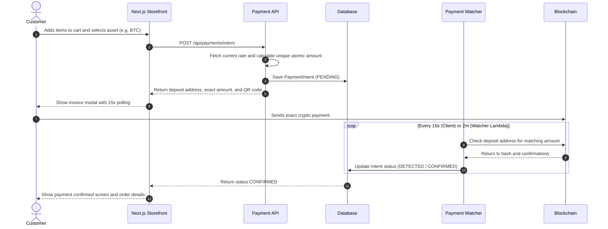

# Crypto E-Commerce Starter Template

A self-custodial cryptocurrency e-commerce template built with Next.js 16 (App Router), TypeScript, Tailwind CSS v4, Prisma ORM, and Python 3.13 serverless payment watchers.

No third-party payment gateways, no monthly fees, and zero hardcoded secrets.

[](https://nextjs.org/)
[](https://www.typescriptlang.org/)
[](https://tailwindcss.com/)
[](https://www.prisma.io/)
[](https://www.python.org/)
[](https://opensource.org/licenses/MIT)

---

## Core Features

- **Direct Self-Custody Payments**: Payments go directly to your own wallet addresses. Supports Bitcoin (BTC), Litecoin (LTC), Solana (SOL), and USDC on Ethereum, Base, Polygon, and Solana.
- **Unique-Amount Matching**: Each order generates a tiny deterministic sub-cent offset (1 to 9999 atomic units). This identifies incoming transactions on a single deposit address without deriving a new address per order or causing collisions.
- **Custom Product Schemas**: Sell standard products, digital downloads, or custom items with user-submitted text and file upload fields defined in JSON.
- **Guest Checkout**: Customers can buy without creating an account. Every order gets a private tracking code (`/track/[code]`).
- **Reseller Portal**: White-label storefront routes (`/r/[slug]`) with tiered wholesale volume pricing.
- **Affiliate System**: Referral tracking links (`?ref=CODE`), cookie attribution, and an affiliate dashboard with commission ledgers.
- **Admin Dashboard**: Live metrics, order fulfillment, carrier tracking, product and coupon management, and payment gateway configuration at `/admin`.
- **R2 / S3 File Uploads**: Direct browser-to-bucket presigned uploads for custom customer attachments and digital product delivery.
- **Zero Secrets in Source**: No merchant wallets, database URLs, or API keys are stored in the repo. An interactive CLI (`npm run setup`) generates local secrets.

---

## Architecture

```
[ Customer Browser ]
       │
       ├─► 1. Select items and configure custom inputs
       ├─► 2. Enter shipping details (guest or logged in)
       ├─► 3. Pick payment asset (BTC, LTC, SOL, EVM USDC)
       │
       ▼
[ Next.js API Routes ]
       │
       ├─► 4. Fetch exchange rate (CoinGecko)
       ├─► 5. Generate unique atomic amount offset
       ├─► 6. Create HMAC-signed invoice session
       │
       ▼
[ Prisma Database (SQLite or Postgres) ] ◄───┐
       ▲                                      │
       │                                      │ 7. Poll and confirm
       │                                      │
[ Python Payment Watcher Lambda ] ────────────┘
       │
       ▼
[ Blockchain Explorers & RPCs ]
 (Esplora, Etherscan V2, Solana RPC)
```

---

## Quick Start

### 1. Install dependencies
```bash
git clone https://github.com/dustindog101/crypto-ecom-template.git
cd crypto-ecom-template
npm install
```

### 2. Run the setup wizard
The wizard generates secure 256-bit keys and creates your `.env.local` file:
```bash
npm run setup
```

### 3. Initialize the database
Push the Prisma schema to SQLite and seed starter products and admin credentials:
```bash
npm run db:push
npm run db:seed
```

### 4. Start the dev server
```bash
npm run dev
```

Open [http://localhost:3000](http://localhost:3000) in your browser.

Default routes:
- Storefront: `http://localhost:3000`
- Order Tracking: `http://localhost:3000/track`
- Admin Dashboard: `http://localhost:3000/admin` (Login: `admin@cryptostore.local` / `adminPassword123!`)
- Reseller Storefront Demo: `http://localhost:3000/r/apex-store`

---

## Payment Flow



---

## Project Structure

```
crypto-ecom-template/
├── app/
│   ├── (storefront)/         # Product catalog, detail page, cart, checkout
│   ├── checkout/pay/[id]/    # Live crypto invoice modal and QR display
│   ├── track/                # Public order tracking by tracking code
│   ├── admin/                # Admin overview, orders, products, payments hub
│   ├── r/[resellerSlug]/     # White-label partner storefront routes
│   ├── reseller/             # Reseller wholesale management dashboard
│   ├── affiliate/            # Affiliate referral and commission portal
│   └── api/                  # API routes (orders, payments, uploads, admin)
├── components/               # UI components (Navbar, CartDrawer, ProductCard)
├── lambdas/                  # Python 3.13 serverless services
│   └── payment_watcher/      # Blockchain poller (Esplora, Etherscan, Solana RPC)
├── lib/
│   ├── payments/             # Crypto math, collision avoidance, address validators
│   ├── storage/              # R2 and S3 presigned upload client
│   ├── cartStore.ts          # Zustand cart store with local persistence
│   └── prisma.ts             # Prisma client singleton
├── prisma/
│   └── schema.prisma         # Database schema (SQLite for dev, Postgres for prod)
├── scripts/
│   ├── setup-wizard.ts       # Interactive setup CLI
│   ├── seed.ts               # Starter catalog and admin seeder
│   └── audit-secrets.ts      # Secret scanner script
└── docs/                     # Specifications, ADRs, and agent context
```

---

## Production Deployment

See [SETUP.md](SETUP.md) for full instructions:
- **Web App**: Deploy to Vercel or any Node.js host.
- **Database**: Use Neon, Supabase, or any PostgreSQL instance.
- **Asset Storage**: Cloudflare R2 or AWS S3.
- **Payment Watcher**: Deploy `lambdas/payment_watcher` to AWS Lambda with an EventBridge rate rule (`rate(2 minutes)`).

---

## Security

- **No Secrets in Git**: All API keys, RPC URLs, and wallet addresses live strictly in environment variables.
- **HMAC Signed Sessions**: Guest invoice tracking uses signed tokens with a 48-hour expiration.
- **Safe Comparisons**: Token checks use `crypto.timingSafeEqual` to prevent timing attacks.

---

## License

MIT (see [LICENSE](LICENSE)).
