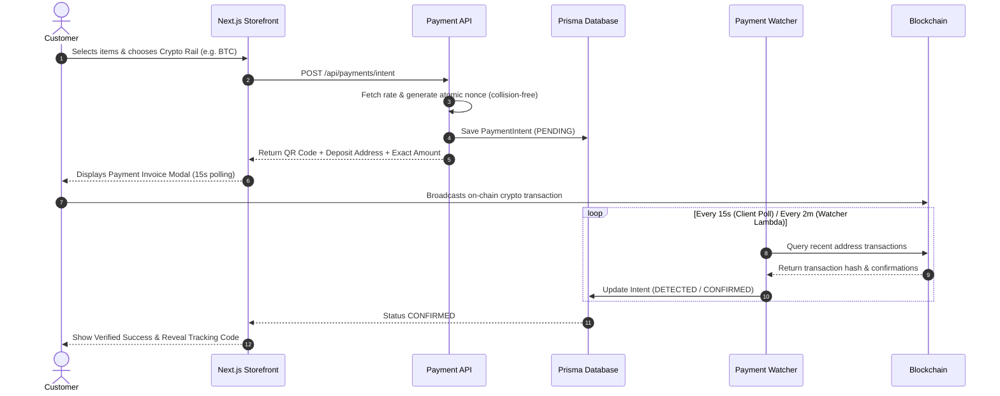

<div align="center">

# ⚡ Crypto E-Commerce Starter Template

**Production-Ready • Self-Custodial • Zero-Secret • Multi-Chain Payments**

A modern, full-featured cryptocurrency e-commerce platform template designed for high conversion, privacy, and zero middleman fees.

[](https://nextjs.org/)
[](https://react.dev/)
[](https://www.typescriptlang.org/)
[](https://tailwindcss.com/)
[](https://www.prisma.io/)
[](https://www.python.org/)
[](https://opensource.org/licenses/MIT)

</div>

---

## 🌟 Highlights

- 🔒 **Self-Custodial & Non-Custodial**: 100% direct-to-merchant wallet settlement. No third-party payment processors or KYC gatekeepers.
- ⚡ **Multi-Chain Payments Out-of-the-Box**: Native support for **Bitcoin (BTC)**, **Litecoin (LTC)**, **Solana (SOL)**, and **USDC** (Ethereum, Base, Polygon, Solana).
- 🎯 **Atomic Collision Avoidance**: Unique sub-cent atomic offset nonces mathematically guarantee distinct on-chain transfer amounts for simultaneous orders.
- 📦 **Dynamic Product Schema & Custom Inputs**: Supports standard goods, physical variants, and declarative custom form input schemas (custom text, selects, file upload slots).
- 🛒 **Frictionless Guest Checkout**: Zero mandatory registration with instant cryptographic public Tracking Codes (`/track/[code]`).
- 🏬 **White-Label Reseller System**: Dedicated `/r/[slug]` storefronts with wholesale volume discount pricing schedules.
- 🤝 **Multi-Tier Affiliate Hub**: Referral link tracking (`?ref=CODE`), attribution cookies, partner portal, and automated commission tracking.
- 📊 **Backoffice Admin Suite (`/admin`)**: Overview KPIs, order fulfillment & tracking manager, product CRUD, coupon manager, and live Payments Hub.
- ☁️ **Cloudflare R2 / S3 Asset Storage**: Direct presigned PUT client uploads with MIME/size validation and authorized presigned GET retrieval.
- 🛡️ **Zero-Secret Design**: Clean `.env.example` with zero hardcoded default credentials and an automated CLI setup wizard (`npm run setup`).

---

## 🏗️ Architecture

```
[ Customer Browser ]
       │
       ├─► (1) Selects Products & Configures Custom Attributes
       ├─► (2) Checks out as Guest or Registered User
       ├─► (3) Selects Crypto Rail (BTC, LTC, SOL, EVM USDC)
       │
       ▼
[ Next.js 16 API Routes ]
       │
       ├─► (4) Fetches Real-Time CoinGecko Exchange Rates
       ├─► (5) Computes Unique Atomic Amount (Collision Avoidance)
       ├─► (6) Mints HMAC Signed Pay Session
       │
       ▼
[ Prisma Database (SQLite / Postgres) ] ◄───┐
       ▲                                     │
       │                                     │ (7) Periodic Reconcile
       │                                     │
[ Python 3.13 Payment Watcher Lambda ] ──────┘
       │
       ▼
[ Blockchain Networks & Explorers ]
 (Esplora • Etherscan V2 • Solana RPC)
```

---

## 🚀 Quick Start (Local Development)

### 1. Clone & Install Dependencies
```bash
git clone https://github.com/dustindog101/crypto-ecom-template.git
cd crypto-ecom-template
npm install # or: bun install
```

### 2. Run the Interactive Setup Wizard
The setup wizard generates 256-bit cryptographically secure keys and configures your `.env.local` file:
```bash
npm run setup # or: bun run setup
```

### 3. Initialize Database & Starter Catalog
Push the Prisma schema and seed demo products, coupons, and admin credentials:
```bash
npm run db:push
npm run db:seed
```

### 4. Start the Dev Server
```bash
npm run dev
```

Visit the application:
- **Storefront**: [http://localhost:3000](http://localhost:3000)
- **Public Order Tracking**: [http://localhost:3000/track](http://localhost:3000/track)
- **Admin Dashboard**: [http://localhost:3000/admin](http://localhost:3000/admin) *(Default login: `admin@cryptostore.local` / `adminPassword123!`)*
- **Reseller Portal Demo**: [http://localhost:3000/r/apex-store](http://localhost:3000/r/apex-store)

---

## 💳 Cryptocurrency Payment Flow



---

## 🗂️ Project Structure

```
crypto-ecom-template/
├── app/
│   ├── (storefront)/         # Home catalog, product detail, cart, checkout
│   ├── checkout/pay/[id]/    # Live crypto invoice modal & QR generator
│   ├── track/                # Public anonymous order lookup
│   ├── admin/                # Backoffice KPI dashboard, orders, products, payments
│   ├── r/[resellerSlug]/     # White-label partner storefront routes
│   ├── reseller/             # Reseller wholesale management portal
│   ├── affiliate/            # Affiliate referral & commission hub
│   └── api/                  # Serverless API routes (orders, payments, uploads)
├── components/               # UI components (Navbar, CartDrawer, ProductCard, UploadSlot)
├── lambdas/                  # Python 3.13 serverless background services
│   └── payment_watcher/      # Blockchain poller (Esplora, Etherscan, Solana RPC)
├── lib/
│   ├── payments/             # Crypto math, atomic collision engine, address validators
│   ├── storage/              # Cloudflare R2 / S3 presigned URL client
│   ├── cartStore.ts          # Zustand persistent shopping cart
│   └── prisma.ts             # Prisma client singleton
├── prisma/
│   └── schema.prisma         # Database schema (SQLite dev / Postgres prod)
├── scripts/
│   ├── setup-wizard.ts       # Interactive setup CLI
│   ├── seed.ts               # Demo data seeder
│   └── audit-secrets.ts      # Automated secret scanner
└── docs/                     # Specifications, ADRs, and AGENTS.md
```

---

## 📦 Production Deployment

See [SETUP.md](SETUP.md) for full deployment instructions:
- **Hosting**: [Vercel](https://vercel.com) (Hobby / Pro tier)
- **Database**: [Neon Postgres](https://neon.tech) (Serverless PostgreSQL free tier)
- **Storage**: [Cloudflare R2](https://www.cloudflare.com/developer-platform/r2/) (Zero egress fees)
- **Watcher**: AWS Lambda + EventBridge cron via AWS SAM (`infra/template.yaml`)

---

## 🛡️ Security & Zero-Secret Guarantee

- **Zero Hardcoded Secrets**: Strictly zero credentials, merchant wallet addresses, or private keys exist in this codebase.
- **HMAC Signed Invoices**: Ephemeral pay tokens allow guests and white-label clients to securely track payment progress without account exposure.
- **Timing-Safe Token Checks**: All cryptographic signature verifications use `crypto.timingSafeEqual`.

---

## 📄 License

MIT © [ID Pirate & Community](LICENSE). Built for the open-source sovereign crypto commerce ecosystem.
